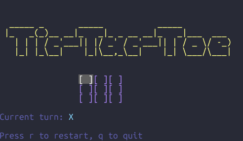

# Tic-Tac-Toe

A beautiful terminal-based tic-tac-toe game built with [BubbleTea](https://github.com/charmbracelet/bubbletea) and [LipGloss](https://github.com/charmbracelet/lipgloss).

## Features

- **Beautiful terminal UI**: Styled with Dracula color scheme
- **Smooth gameplay**: Use arrow keys or vim-style navigation
- **Win detection**: Highlights winning combinations
- **Draw detection**: Recognizes when the game is a tie
- **Multiplayer!**: Two players can play remotely over SSH!

## How to Play

### Single Player Mode

1. **Run the game**:
   ```bash
   go run main.go
   ```

2. **Game controls**:
   - Use arrow keys or `hjkl` to move cursor
   - Press `Enter` or `Space` to place your mark
   - Press `r` to restart the game
   - Press `q` to quit

### Multiplayer Mode (SSH)

1. **Start the SSH game server**:
   ```bash
   go run main.go ssh
   ```
   
   The server will start on port 2222 and display:
   ```
   Starting SSH Tic-Tac-Toe server on :2222
   Players can connect with: ssh -p 2222 localhost
   Note: Using temporary host keys (more secure)
   ```

2. **Players connect to the game**:
   ```bash
   # First player (becomes X)
   ssh -p 2222 localhost
   
   # Second player (becomes O)
   ssh -p 2222 localhost
   ```

3. **Game flow**:
   - First player to connect becomes X and waits for a second player
   - Second player automatically becomes O and the game begins
   - Players take turns using the same controls as single player mode
   - If a player disconnects, the other player gets a 5-second warning before the game ends

4. **External access** (optional):
   - To allow players outside your network, you can use ngrok:
     ```bash
     ngrok tcp 2222
     ```
   - Players can then connect using the ngrok URL provided

## Game Flow

- Players take turns placing X and O marks
- Game ends when someone wins or it's a draw
- Winning combinations are highlighted in green
- Press 'r' to restart at any time
- Press 'q' to quit at any time (other player will be notified before their game quits)

## Technical Details

- Built with Go using Charmbracelet libraries (Thanks Charmbracelet, you guys make awesome stuff! ❤️)
- Local single-player game
- SSH-based multi-player game
- Beautiful ASCII art win screens

## Dependencies

- `github.com/charmbracelet/bubbletea` - Terminal UI framework
- `github.com/charmbracelet/lipgloss` - Terminal styling
- `github.com/charmbracelet/wish` - SSH server framework (for multiplayer)
- `github.com/charmbracelet/ssh` - SSH library (for multiplayer)

## Building

```bash
go build -o tictactui .
./tictactui
```

## Example Screenshot



## Coming Soon!

- Matchmaking!
- Tournament mode!
- And much much more! (maybe not much much but...definitely more!)